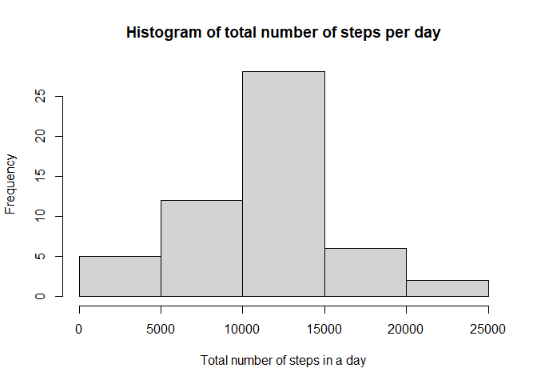
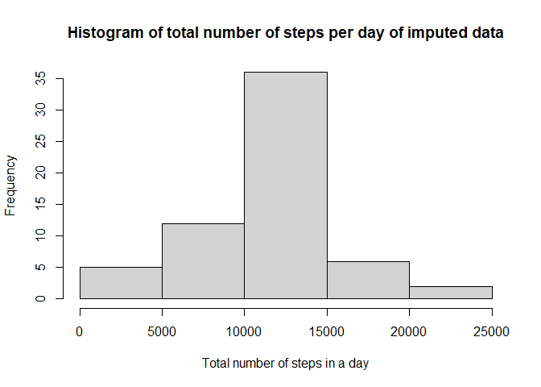
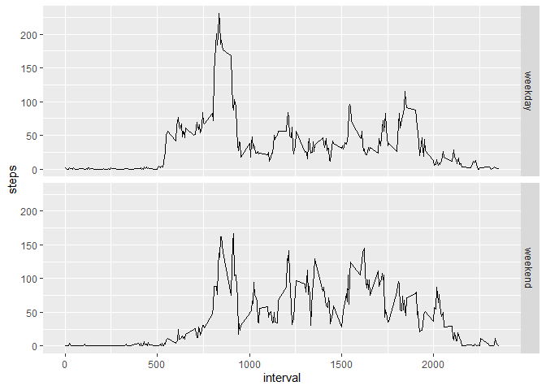

==========================================

INTRODUCTION ABOUT THE DATA:

It is now possible to collect a large amount of data about personal movement using activity monitoring devices such as a Fitbit, Nike Fuelband, or Jawbone Up. These type of devices are part of the “quantified self” movement – a group of enthusiasts who take measurements about themselves regularly to improve their health, to find patterns in their behavior, or because they are tech geeks. But these data remain under-utilized both because the raw data are hard to obtain and there is a lack of statistical methods and software for processing and interpreting the data.

This assignment makes use of data from a personal activity monitoring device. This device collects data at 5 minute intervals through out the day. The data consists of two months of data from an anonymous individual collected during the months of October and November, 2012 and include the number of steps taken in 5 minute intervals each day.

DATA CAN BE COLLECTED FROM : https://d396qusza40orc.cloudfront.net/repdata%2Fdata%2Factivity.zip


```r
## Loading the data
dataset<-read.csv(unz("activity.zip","activity.csv"))
#Processing the data
dataset<- transform(dataset,date=as.Date(date,format="%Y-%m-%d"))
```
Let's take look at the data

```r
#Taking a look at the statistics and structure of the data
head(dataset)
```

```
##   steps       date interval
## 1    NA 2012-10-01        0
## 2    NA 2012-10-01        5
## 3    NA 2012-10-01       10
## 4    NA 2012-10-01       15
## 5    NA 2012-10-01       20
## 6    NA 2012-10-01       25
```

```r
tail(dataset)
```

```
##       steps       date interval
## 17563    NA 2012-11-30     2330
## 17564    NA 2012-11-30     2335
## 17565    NA 2012-11-30     2340
## 17566    NA 2012-11-30     2345
## 17567    NA 2012-11-30     2350
## 17568    NA 2012-11-30     2355
```

```r
summary(dataset)
```

```
##      steps             date               interval     
##  Min.   :  0.00   Min.   :2012-10-01   Min.   :   0.0  
##  1st Qu.:  0.00   1st Qu.:2012-10-16   1st Qu.: 588.8  
##  Median :  0.00   Median :2012-10-31   Median :1177.5  
##  Mean   : 37.38   Mean   :2012-10-31   Mean   :1177.5  
##  3rd Qu.: 12.00   3rd Qu.:2012-11-15   3rd Qu.:1766.2  
##  Max.   :806.00   Max.   :2012-11-30   Max.   :2355.0  
##  NA's   :2304
```

```r
str(dataset)
```

```
## 'data.frame':	17568 obs. of  3 variables:
##  $ steps   : int  NA NA NA NA NA NA NA NA NA NA ...
##  $ date    : Date, format: "2012-10-01" "2012-10-01" ...
##  $ interval: int  0 5 10 15 20 25 30 35 40 45 ...
```


### Histogram of the total number of steps taken each day

```r
byday <- aggregate(steps~date,data=dataset,FUN=sum,na.rm=TRUE)
hist(byday$steps, main="Histogram of total number of steps per day", xlab="Total number of steps in a day")
```

<!-- -->

### Mean and median number of steps taken each day

```r
meann<-mean(byday$steps)
mediann<-median(byday$steps)
```
**The mean and median of steps taken each day respectively is 1.0766189\times 10^{4} and 10765**


### Time series plot of the average number of steps taken

```r
byintervalmean <- aggregate(steps~interval,data=dataset,FUN=mean,na.rm=TRUE)
with(byintervalmean,plot(interval,steps,type="l"))
```

<!-- -->

###The 5-minute interval that, on average, contains the maximum number of steps


```r
maxrow<-which.max(byintervalmean$steps)
maxinterval<-byintervalmean[maxrow,]
```
**The interval with the highest avg steps is 835  and the avg no of steps for that interval is 206.1698113**

### Code to describe and show a strategy for imputing missing data

**Imputing missing values**

Noting that there are a number of days/intervals where there are missing values (coded as NA). The presence of missing days may introduce bias into some calculations or summaries of the data.

- Calculating and reporting the total number of missing values in the dataset (i.e. the total number of rows with NAs)

- Devising a strategy for filling in all of the missing values in the dataset.We have adopted a strategy to replace the missing NA values with the average steps in that interval across all the days.

- Creating a new dataset that is equal to the original dataset but with the missing data filled in.

- Making a histogram of the total number of steps taken each day and Calculating and report the mean and median total number of steps taken per day. 


```r
library(lubridate)
```

```
## Warning: package 'lubridate' was built under R version 4.0.2
```

```
## 
## Attaching package: 'lubridate'
```

```
## The following objects are masked from 'package:base':
## 
##     date, intersect, setdiff, union
```

```r
#new dataset
imputedata<- dataset
#imputing data and filling the missing values in new dataset
for(i in 1:nrow(imputedata))
{
    if(is.na(imputedata$steps[i]))
{
          intervalval<- imputedata$interval[i]
          stepsval <- byintervalmean[byintervalmean$interval == intervalval,]
          imputedata$steps[i] <-stepsval$steps
}
}

bydaynewdata <- aggregate(steps~date,data=imputedata,FUN=sum,na.rm=TRUE)
hist(bydaynewdata$steps, main="Histogram of total number of steps per day of imputed data", xlab="Total number of steps in a day")
```

<!-- -->

**Its time to find out if mean and median have changed in the imputed dataset**

```r
mean(bydaynewdata$steps)
```

```
## [1] 10766.19
```

```r
median(bydaynewdata$steps)
```

```
## [1] 10766.19
```
**We note that the mean and the median has NOT changed because of the imputed values**

### Panel plot comparing the average number of steps taken per 5-minute interval across weekdays and weekends,Are there differences in activity patterns between weekdays and weekends?

```r
library(ggplot2)
```

```
## Warning: package 'ggplot2' was built under R version 4.0.2
```

```r
imputedata$dayofweek<- weekdays(as.Date(imputedata$date))
imputedata$dayofweek[imputedata$dayofweek %in% c("Saturday","Sunday")]<- "weekend"
imputedata$dayofweek[imputedata$dayofweek != "weekend"]<- "weekday"
imputedata$dayofweek<- as.factor(imputedata$dayofweek)
difference<- aggregate(steps ~ interval + dayofweek, imputedata, mean)
qplot(interval,steps,data=difference,facets=dayofweek~.,geom=c("line"))
```

<!-- -->
